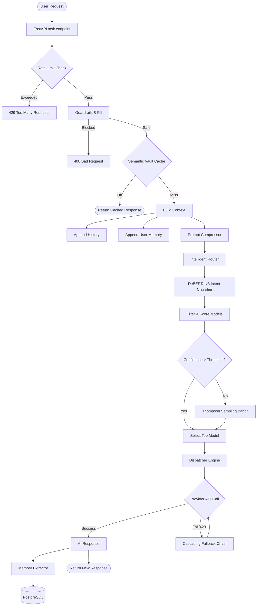
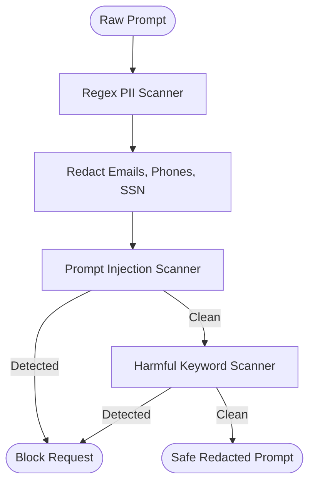
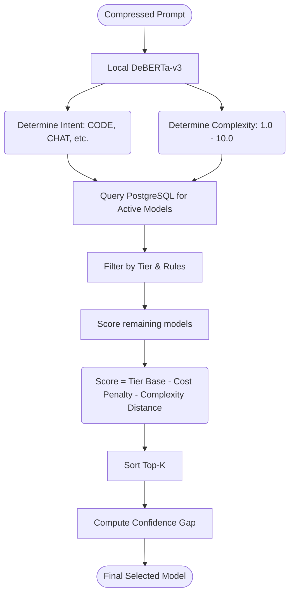
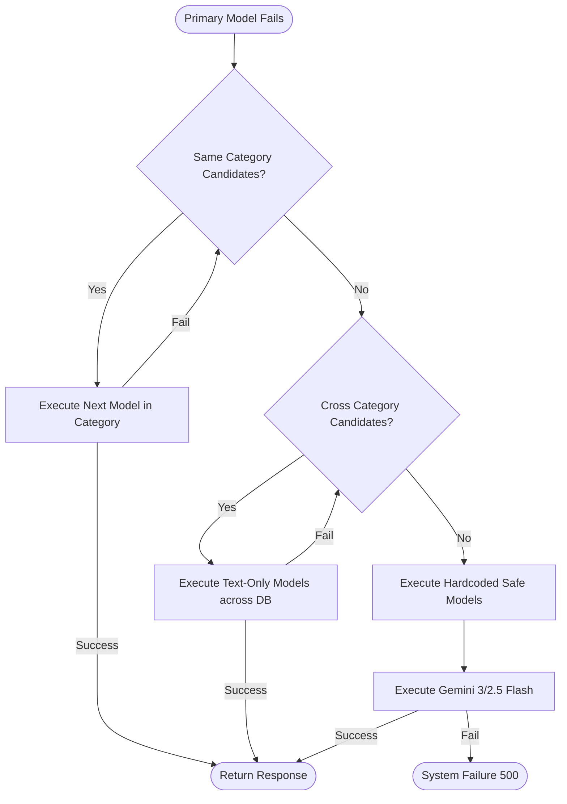
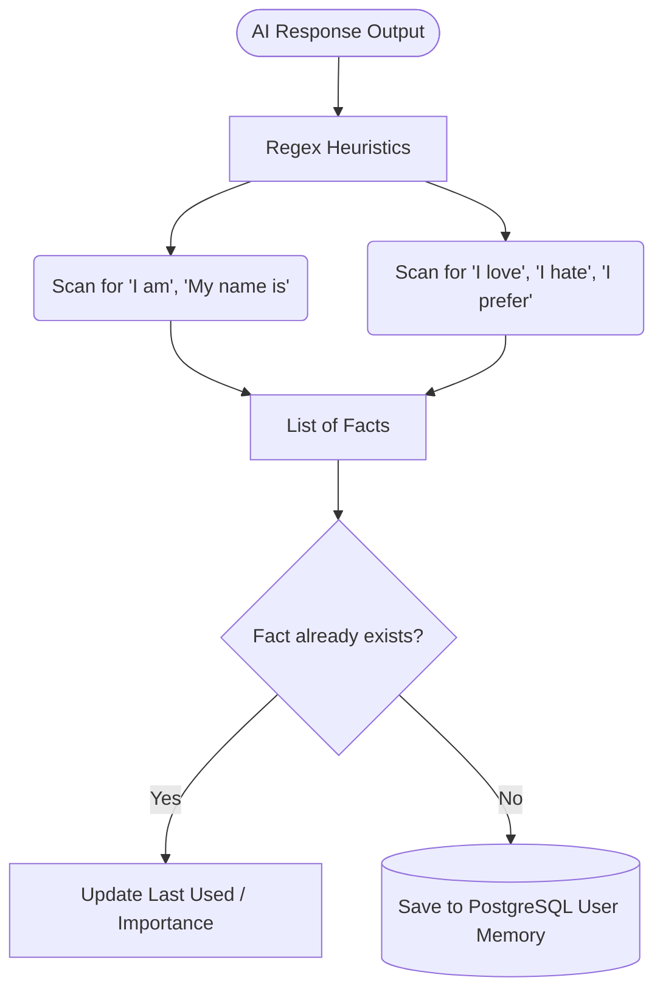

# AI Router Flowcharts

This document provides visual representations of the AI Router's internal architecture and feature workflows.

## 1. Overall System Architecture Flow

## 2. Guardrails & Security Flow

## 3. Intelligent Routing Flow

## 4. Cascading Fallback Engine

## 5. User Memory Extraction Flow

